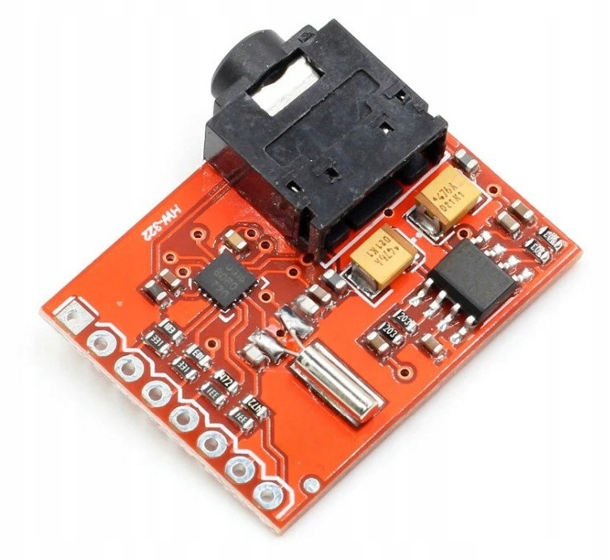

# Radio-FM-tuner-Si4703-ESPHOME
in development add more settings later  
  
Config yaml:
```external_components:
  - source: github://tiimsvk/Radio-FM-tuner-Si4703-ESPHOME@main
    components: [si4703_fm]

i2c:
  sda: GPIO0
  scl: GPIO1
  scan: true
  
si4703_fm:
  id: fm_tuner
  address: 0x10 
  reset_pin: GPIO4    
  stc_int_pin: GPIO3 

number:
  - platform: si4703_fm
    si4703_fm_id: fm_tuner
    number_frequency:
      name: "FM Frequency"
      id: fm_frq
      min_value: 87.5
      max_value: 108.0
      step: 0.1
      optimistic: true
    
    number_volume:
      name: "FM Rádiová Hlasitosť"
      min_value: 0
      max_value: 15
      step: 1
      # Nastavenie na slider
      mode: SLIDER
    
sensor:
  - platform: si4703_fm
    name: "FM RSSI"
    id: fm_rssi
    accuracy_decimals: 0
    si4703_fm_id: fm_tuner

switch:
  - platform: si4703_fm
    si4703_fm_id: fm_tuner
    power_switch:
      name: "FM Rádio Power"
      id: fm_power_switch```
